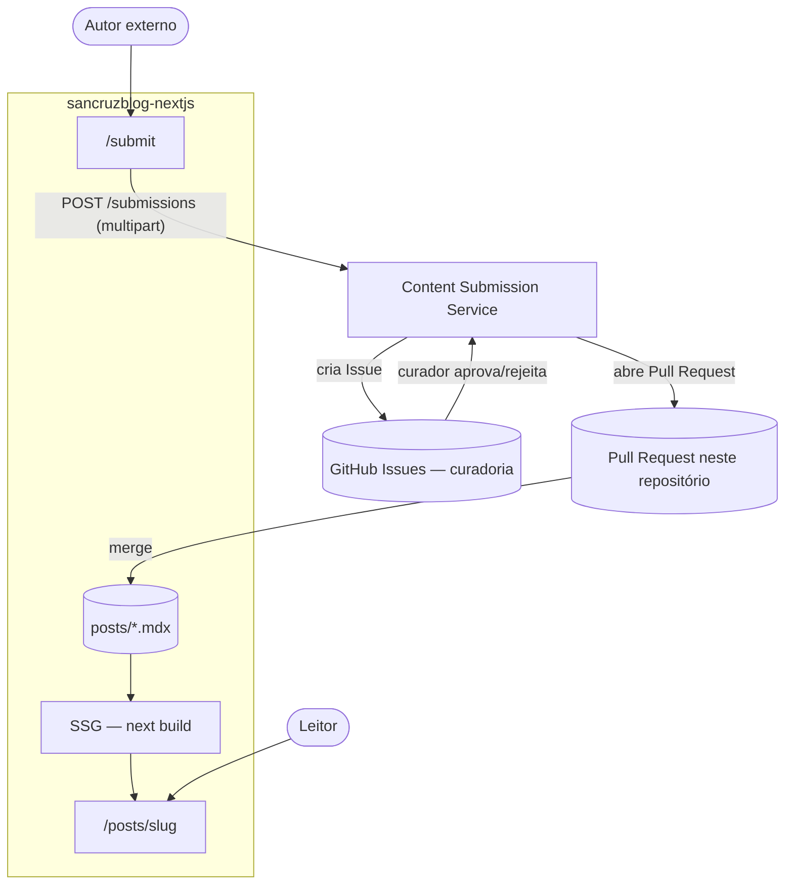
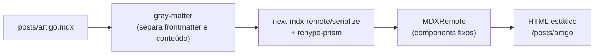
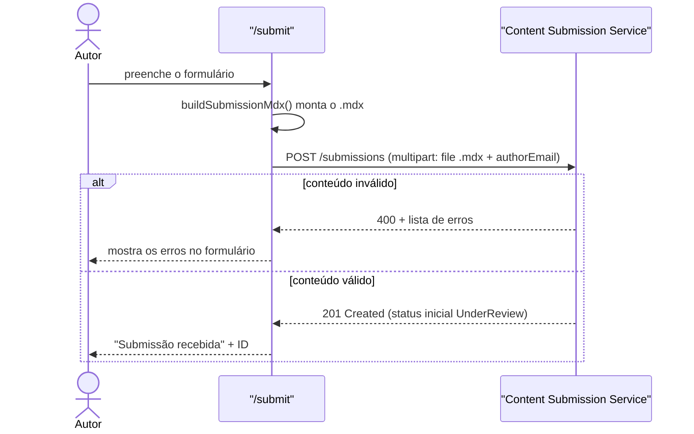

# SanCruz Blog


## Sobre o projeto

Blog pessoal sobre desenvolvimento front-end, arquitetura de sistemas e
carreira em tecnologia. Os artigos são escritos em MDX, versionados neste
mesmo repositório e renderizados estaticamente pelo Next.js.

Este projeto também é parte do meu portfólio pessoal — feedback sobre
código, estrutura ou qualquer outro ponto de melhoria é muito bem-vindo.

Além do blog em si, o projeto vem evoluindo para uma pequena plataforma de
publicação colaborativa: qualquer pessoa pode propor um artigo pela página
[`/submit`](pages/submit.js), que é validado e curado por um serviço
separado — o [Content Submission Service](https://github.com/sancruz-dev/microservice-submission-blog)
— antes de virar um Pull Request neste repositório.

## Arquitetura

O sistema tem duas partes, cada uma em seu próprio repositório: este blog
(Next.js, geração estática) e o
[Content Submission Service](https://github.com/sancruz-dev/microservice-submission-blog)
(.NET, workflow de submissão e curadoria). O diagrama abaixo mostra os dois
fluxos principais — ler um post publicado e propor um artigo novo:



Ou seja: um artigo aprovado volta para este mesmo repositório como um Pull
Request — mergear o PR é o que efetivamente "publica" o post, porque
adiciona um novo arquivo em `posts/` que o próximo build estático já inclui.
Os detalhes do workflow de curadoria (Issues, webhooks, estados da
submissão) estão no
[README do Content Submission Service](https://github.com/sancruz-dev/microservice-submission-blog#readme).

## Stack

- [**Next.js**](https://nextjs.org/) (Pages Router) — geração estática (SSG) das páginas
- [**React 18**](https://react.dev/)
- [**Tailwind CSS**](https://tailwindcss.com/) + `@tailwindcss/typography`
- [**next-mdx-remote**](https://github.com/hashicorp/next-mdx-remote) — parsing e renderização do conteúdo MDX
- [**gray-matter**](https://github.com/jonschlinkert/gray-matter) — leitura do frontmatter dos posts
- [**rehype-prism**](https://github.com/mapbox/rehype-prism) — syntax highlighting nos blocos de código
- ESLint (`eslint-config-next`) + Prettier

## Estrutura do projeto

```
pages/             rotas do Next.js (Pages Router)
  posts/[slug].js    renderização de um post via MDXRemote
  posts.js           listagem de posts
  submit.js          formulário de envio de artigos
components/        componentes de UI e os renderers usados dentro do MDX
posts/             conteúdo dos artigos (.mdx)
utils/             leitura/parsing de MDX, dados globais, montagem do .mdx de submissão
public/            assets estáticos
```

## Como os posts funcionam

Cada artigo é um arquivo `.mdx` dentro de `posts/`. O nome do arquivo
(sem extensão) define o slug da URL (`/posts/<slug>`). Todo o conteúdo é
lido do sistema de arquivos em build-time — não há CMS nem banco de dados
envolvidos nesta etapa do projeto.



O `components` passado ao `MDXRemote` é uma lista fechada (`a`, `h2`, `img`,
...) definida em `pages/posts/[slug].js`, não o conteúdo livre do post: como
o MDX não passa pelo bundler do webpack, um `import` dentro de um post até
compila, mas quebra em tempo de renderização (ver a observação em
`components/ComponentsForMDX.js`).

Frontmatter esperado em cada post:

```yaml
---
title: 'Título do artigo'
description: 'Resumo curto usado na listagem e em SEO.'
date: '2026-08-25' # formato ISO (YYYY-MM-DD)
slug: nome-do-arquivo # deve bater com o nome do arquivo .mdx
author: 'Nome do autor'
category: 'Backend'
level: 'Beginner' # Beginner | Intermediate | Advanced
tags:
  - exemplo
  - tags
---
```

## Getting Started

### Instalando as dependências

```bash
npm install
```

### Rodando em desenvolvimento

```bash
npm run dev
```

Ou, para observar mudanças nos arquivos `.mdx` e recarregar automaticamente:

```bash
npm run dev:watch
```

### Build de produção

```bash
npm run build
npm run start
```

### Lint

```bash
npm run lint
```

## Variáveis de ambiente

Todas são opcionais e têm um valor padrão — só precisam ser definidas para
customizar o comportamento.

| Variável | Padrão | Uso |
|---|---|---|
| `NEXT_PUBLIC_SUBMISSION_SERVICE_URL` | `http://localhost:5211` | URL do Content Submission Service, usada pela página `/submit` |
| `BLOG_NAME`, `BLOG_TITLE`, `SEO_DESC`, `BLOG_FOOTER_TEXT` | textos do tema padrão | Nome do blog, título de SEO, descrição e rodapé — ver `utils/global-data.js` |
| `BLOG_THEME`, `BLOG_FONT_HEADINGS`, `BLOG_FONT_BODY` | tema padrão | Customização visual — ver `utils/tailwind-preset.js` |

## Envio de artigos (`/submit`)

A página [`/submit`](pages/submit.js) é um formulário para enviar um artigo
para revisão. Ela monta um arquivo `.mdx` (frontmatter + conteúdo) a partir
dos campos preenchidos e envia para o
[Content Submission Service](https://github.com/sancruz-dev/microservice-submission-blog),
que valida o conteúdo e conduz o workflow de curadoria.



O que acontece depois — criação da Issue de curadoria, aprovação/rejeição
humana, Pull Request automático — é responsabilidade do Content Submission
Service; veja o diagrama do workflow completo no
[README daquele repositório](https://github.com/sancruz-dev/microservice-submission-blog#readme).

Para funcionar em desenvolvimento, o serviço precisa estar rodando (por
padrão em `http://localhost:5211`; configurável via
`NEXT_PUBLIC_SUBMISSION_SERVICE_URL` no `.env`). Sem o serviço no ar, o
formulário mostra uma mensagem de erro de conexão.

## Deploy

O deploy é feito na [Vercel](https://vercel.com/), com suporte nativo ao
Next.js. Cada push no branch principal gera um novo build estático do
site.

## Roadmap

O projeto evoluiu de um blog pessoal estático para uma pequena plataforma
de publicação colaborativa: submissão de artigos por terceiros, curadoria
humana via GitHub Issues e publicação automatizada via Pull Request (ver os
diagramas acima). O roadmap de fases, as decisões de arquitetura (ADRs) e o
restante da documentação técnica vivem no repositório do
[Content Submission Service](https://github.com/sancruz-dev/microservice-submission-blog/tree/main/docs),
que é quem conduz esse workflow.

## Autor

- **Sanmir Cruz**

## Licença

Este projeto está licenciado sob a licença MIT — veja o arquivo
[LICENSE.md](./LICENSE.md) para mais detalhes.
